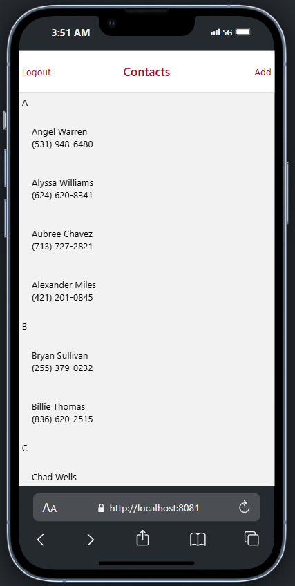

# React Native Contact App

This application covers the basic aspects and concepts of React Native. It includes features such as:

- **User Authentication**: Login and logout functionality.
- **Contact Management**:
  - Display a list of contacts.
  - Add new contacts.
  - View details of a contact.
  - Navigate to a random contact.
- These functionalities are implemented using React components like navigation (Switch, Stack, Composing, Tab), data fetching, Redux, and Redux Persist for state management.

---

## Requirements

To run this project, ensure you have the following:

- Node.js version **22.11.0**  
  Check your version by running:
  ```bash
  node --version
  ```

---

## Getting Started

Follow these steps to set up and run the project:

1. Clone the repository and navigate to the project directory:

   ```bash
   cd ContactsApp
   ```

2. Install dependencies:

   ```bash
   npm install
   ```

3. Run the app:
   ```bash
   npx expo start -c
   ```
   If you're on a private network, use:
   ```bash
   npx expo start -c --tunnel
   ```

---

# MockFastAPI Server

## Prerequisites

Ensure you have the following installed:

- Python version 3.0 or later.

## Setup Instructions

1. **Install Virtual Environment**

   Use pip to install the virtual environment package:

   ```bash
   pip3 install virtualenv
   ```

2. **Navigate to Project Directory**

   Change into the `mockAuthEndpoint` directory:

   ```bash
   cd mockAuthEndpoint
   ```

3. **Create a Virtual Environment**

   - On Linux/Mac:
     ```bash
     virtualenv venv_folder_name
     ```
   - On Windows:
     ```bash
     python -m venv venv_folder_name
     ```

4. **Activate the Virtual Environment**

   - On Linux/Mac (Command Line):
     ```bash
     source venv_folder_name/bin/activate
     ```
   - On Windows (Command Line):
     ```bash
     venv_folder_name\Scripts\Activate.bat
     ```

5. **Install Dependencies**

   Install the required dependencies using the `requirements.txt` file:

   ```bash
   pip install -r requirements.txt

   ```

6. **Run FastAPI server**

   Make sure your are into the `mockAuthEndpoint` directory and on a seperate CLI than the one running your expo app:

   ```bash
   python main.py

   ```

## Resources

### React Icons

- Install:
  ```bash
  npm install --save react-native-vector-icons
  ```
- Documentation: [react-native-vector-icons](https://www.npmjs.com/package/react-native-vector-icons#installation)

### Tab Navigation

- Install:
  ```bash
  npm install @react-navigation/bottom-tabs
  ```
- Documentation: [Bottom Tab Navigator](https://reactnavigation.org/docs/bottom-tab-navigator/)

### Stack Navigation

- Install:
  ```bash
  npm install @react-navigation/native
  npm install react-native-screens react-native-safe-area-context
  ```
- Documentation: [React Navigation - Getting Started](https://reactnavigation.org/docs/getting-started)

For more information on React Native and component design patterns, check out this guide:  
[**Dumb Components and Smart Components**](https://medium.com/@thejasonfile/dumb-components-and-smart-components-e7b33a698d43)

---

A "slice" is a collection of Redux reducer logic and actions for a single feature in your app, typically defined together in a single file.

ressource
https://medium.com/@thejasonfile/dumb-components-and-smart-components-e7b33a698d43

## Screenshots

  
_Login screen showcasing user authentication._

  
_Contact list with options to view ,add contacts or logout._

  
_Add Contact._

  
_View Contact Detail Screen._

---
